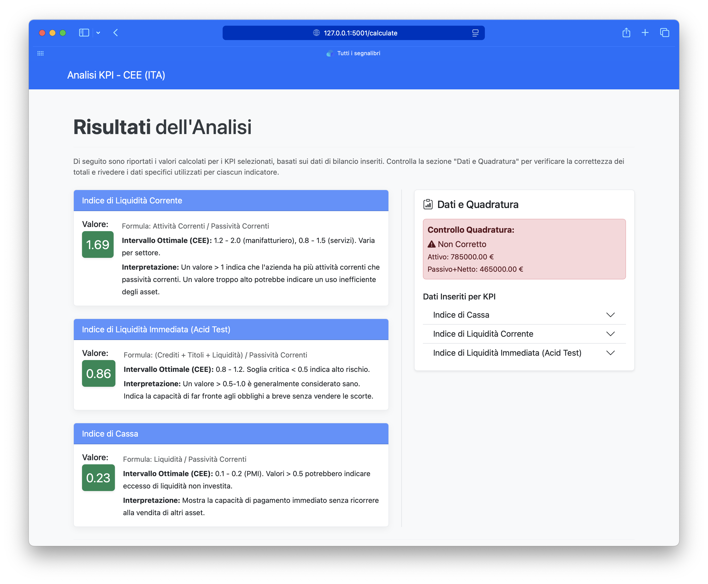

# Flask Balance Sheet Analyzer

This folder contains demo screenshots and usage examples for the Flask web application that analyzes balance sheets in the CEE (Italian GAAP) format.

**The full application, source code, and documentation are maintained in the original open-source repository:**
[italian-gaap-kpi-analyzer](https://github.com/VincenzoRocchi/italian-gaap-kpi-analyzer)

## Demo: Example Analysis Flow

Below are screenshots from a test run of the app using example data. The data file used is available in [`demo-screenshots/data/Esempio_Bilancio_Analisi_KPI.xlsx`](demo-screenshots/data/Esempio_Bilancio_Analisi_KPI.xlsx).

1. **KPI Selection (first part):**
   
2. **KPI Selection (scroll, more KPIs):**
   
3. **Data Entry Example:**
   
4. **Results Page:**
   

> These screenshots use test data. The corresponding data file is provided in the `data/` folder above.

## Key Points
- **Privacy-first:** The app is designed to run locally or on your own server. No data leaves your machine.
- **Open Source:** Full code, issues, and updates are available in the original repository.
- **Demo Materials:** This folder will include only screenshots and example reports to showcase the app's features.

## Where to find more
- For installation, usage, and support, please refer to the [original repository](https://github.com/VincenzoRocchi/italian-gaap-kpi-analyzer).
- This folder will be updated with demo materials soon. 